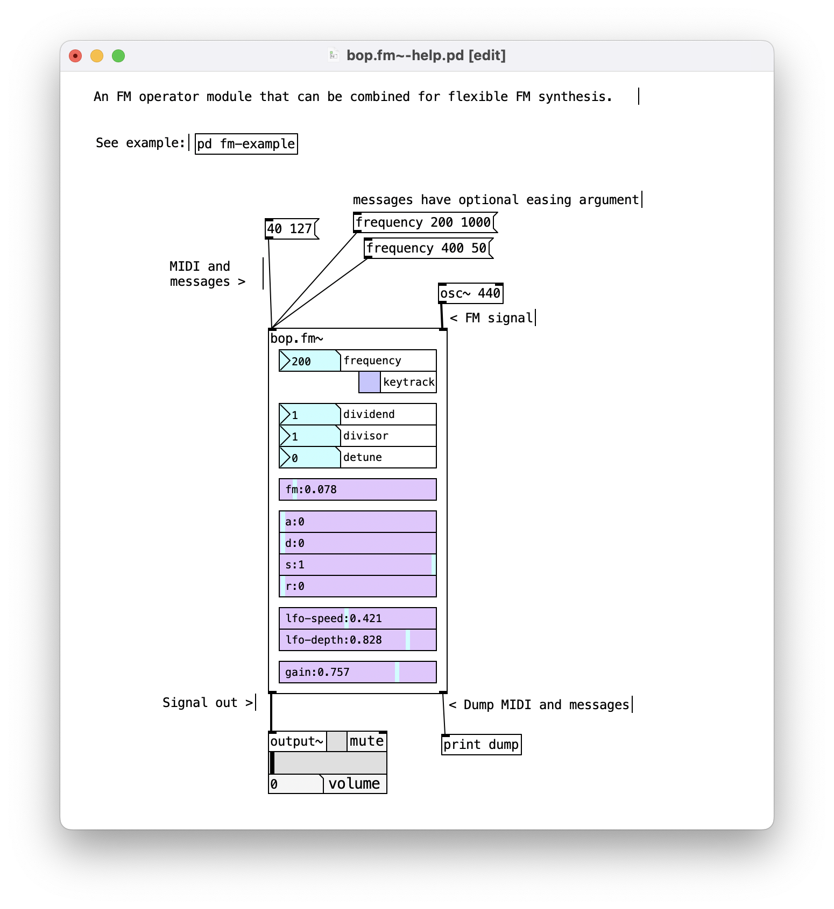

## 🦉 Note: an updated version of this abstraction can be found in [bop](https://github.com/zealtv/bop)

# pdfm
A flexible FM operator for Pure Data

bop.fm~.pd is an FM operator abstraction.  Multiple instances can be patched together for simple to complex FM patches.  The abstraction uses savestate to save it's state when a parent patch is saved.  

